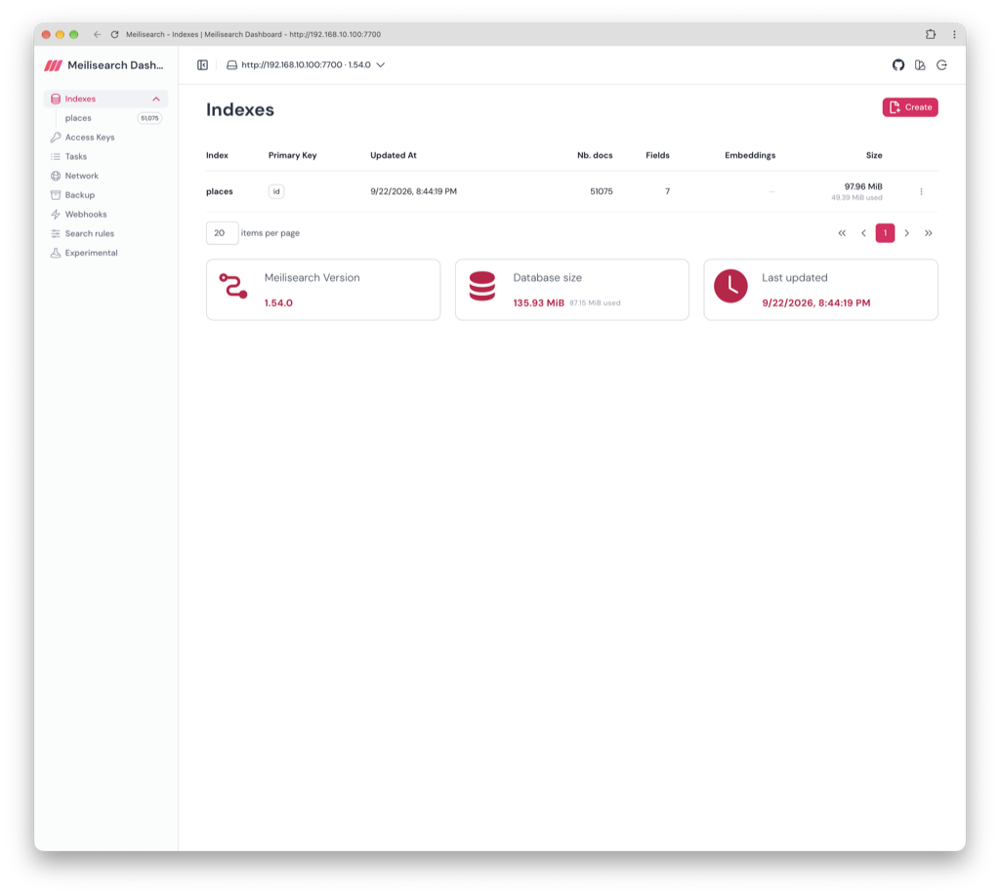
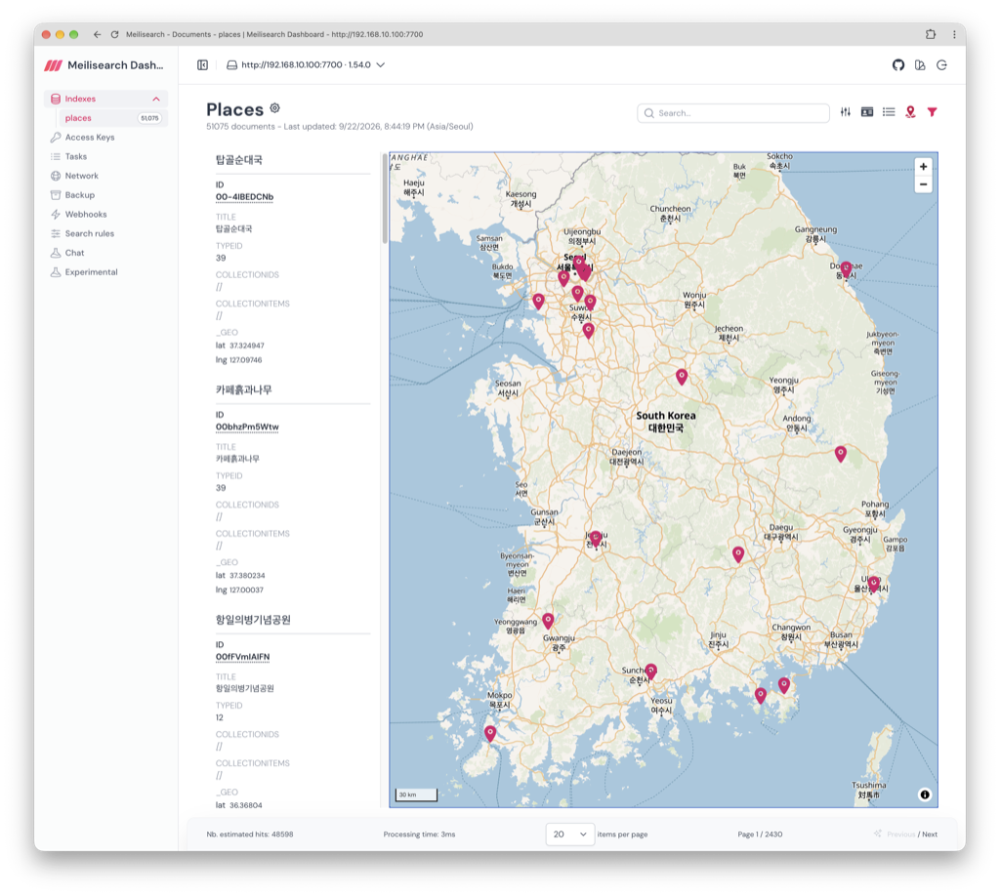
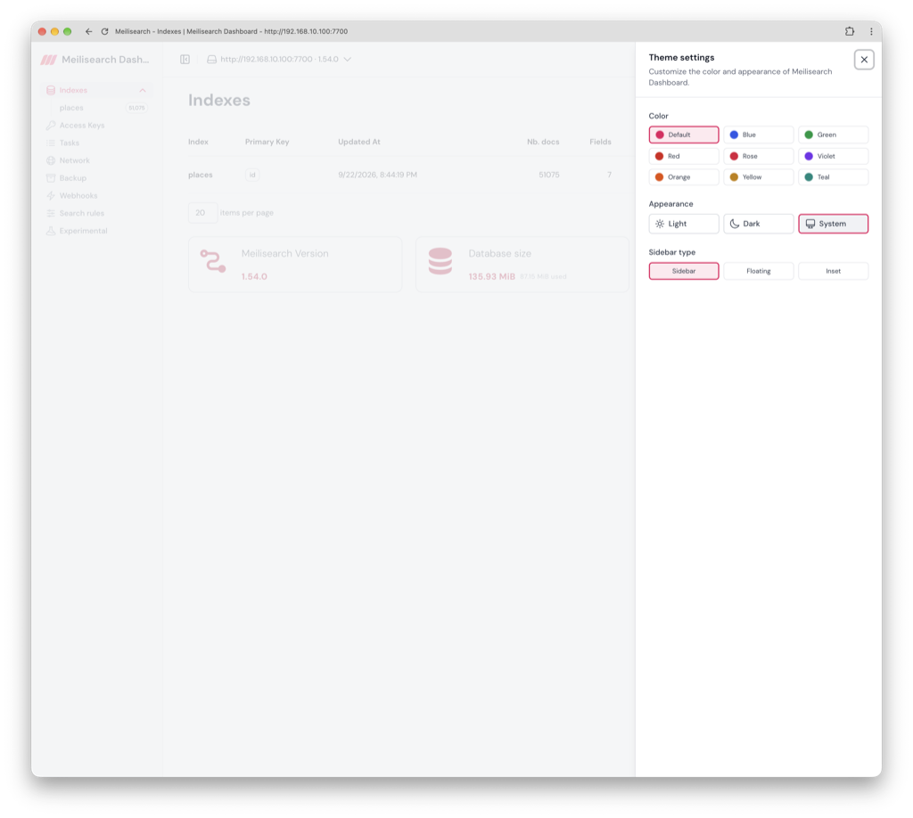

# Meilisearch Dashboard

[Meilisearch Dashboard](https://meilisearch.pages.dev) is a web-based administration panel
that helps you store, organize and visualize data in your [Meilisearch](https://meilisearch.com) instances.

<p align="center">
  
  
  
</p>

## Features

- 🛢️ **Indexes**: create indexes, browse and edit every setting (searchable / filterable / sortable
  attributes, ranking rules, typo tolerance, synonyms, stop words, dictionary, separator tokens,
  embedders, displayed fields, foreign keys...). The sidebar lists every index with its live
  document count, so you can jump straight to one without opening the Indexes page.
- 🔍 **Documents**: import, search, sort, filter, edit, delete documents
- 🗝️ **Access keys**: create keys, generate tenant tokens (JWTs)
- 📋 **Tasks**: browse and monitor the task queue in real time over Meilisearch's `/tasks/stream`
  (SSE), with an automatic fallback to polling on older instances or when the stream is unavailable
- 🅿️ **Backup**: one-click dumps, snapshots and index export to a remote instance
- 🕸️ **Network**: manage multi-instance / sharded network settings
- 🪝 **Webhooks**: manage webhooks
- 🧭 **Search rules**: manage search rules, including editable dynamic search rule filter conditions
- 💬 **Chat**: use Meilisearch's AI-powered chat, when enabled on the instance
- 🧠 **Embedders**: configure embedders and preview their rendered document template against a real
  document before saving
- 🧪 **Experimental features**: toggle Meilisearch experimental features from the UI
- 🎨 **Theming**: light/dark/system appearance, accent color and sidebar layout, all customizable from the UI
- 🗺️ **Map view**: browse geo-tagged documents on an [OpenFreeMap](https://openfreemap.org) map, with
  automatic light/dark map styling

## Demo

You can run Meilisearch Dashboard on your search instances, provided they expose appropriate CORS headers, on [https://meilisearch.pages.dev](https://meilisearch.pages.dev).

## Local usage

Meilisearch Dashboard is a [Nuxt 4](https://nuxt.com/) single-page application that entirely runs on the client
side: there's no backend, it talks directly to your Meilisearch instance from the browser.

If you have some basics with [Vue 3](https://vuejs.org/) (Composition API), [Tailwind CSS](https://tailwindcss.com/)
and [Nuxt UI](https://ui.nuxt.com/), you will easily figure out how this application has been structured.

[Bun](https://bun.sh/) is required to install packages.

Feel free to contribute!

- [Discussions](https://github.com/deepflowteam/meilisearch-dashboard/discussions): Ask questions, share ideas, suggest features
- [Issues](https://github.com/deepflowteam/meilisearch-dashboard/issues): Report bugs
- [Pull requests](https://github.com/deepflowteam/meilisearch-dashboard/pulls): Request changes

### Installation

You mostly don't need to install it on your computer. Just head up to [https://meilisearch.pages.dev](https://meilisearch.pages.dev) and fill your instance credentials.

If for some reason you want to run it locally, you can clone the repository and install dependencies:

```bash
git clone https://github.com/deepflowteam/meilisearch-dashboard.git
cd meilisearch-dashboard
bun install
```

### Launch dev server

```bash
bun run dev
```

### Build & preview

```bash
bun run build && bun run preview
```

### Docker build

```bash
docker build -t meilisearch-dashboard .
```

### Docker run

```bash
docker run -p 3000:3000 -d meilisearch-dashboard
```

### Docker Compose

```bash
docker compose up -d --build
```

### Code style

Formatting and linting are handled by [oxfmt](https://oxc.rs/docs/guide/usage/formatter) and
[oxlint](https://oxc.rs/docs/guide/usage/linter).

#### Fix formatting

```bash
bun run format
```

#### Lint

```bash
bun run lint
```

#### Check both (formatting + lint)

```bash
bun run check
```
